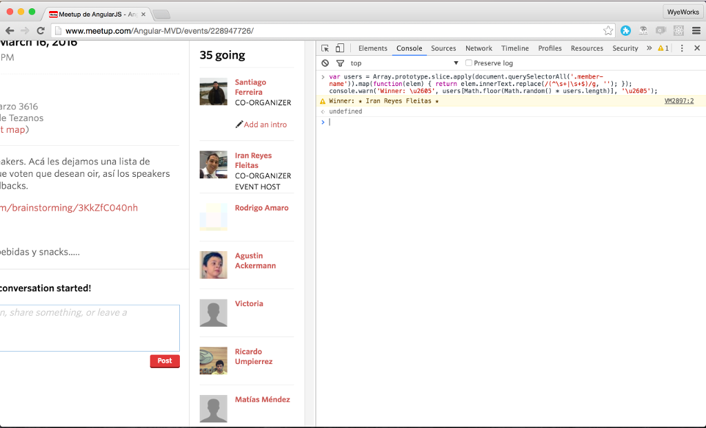

# Meetup Draw

The easiest way to hold a drawing!



1. Go to the current meetup page
2. Ensure that all attendees are loaded in the page
3. Open the Javascript console
4. Paste and run the following snippet

```js
var users = Array.prototype.slice.apply(document.querySelectorAll('.event-attendees .member-name')).map(function(elem) { return elem.innerText.replace(/(^\s+|\s+$)/g, ''); }); console.warn('Winner: \u2605', users[Math.floor(Math.random() * users.length)], '\u2605');
```

5. Repeat as many times as you need
6. Done.

## License

meetup-draw is licensed under the MIT license.

See [LICENSE](./LICENSE.md) for the full license text.
